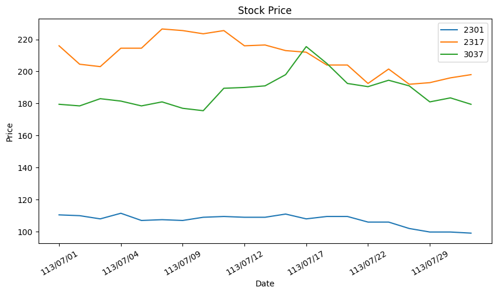

# stock-crawler
* Updated: 2024/08/05
* Objective: Retrieve historical stock price data from [TWSE](https://www.twse.com.tw/zh/trading/historical/stock-day-avg.html) and visualize it using a line chart.
* Required Packages: BeautifulSoup, Matplotlib, Pandas, Selenium, Time
* Development Environment: Google Colab
* Result:

